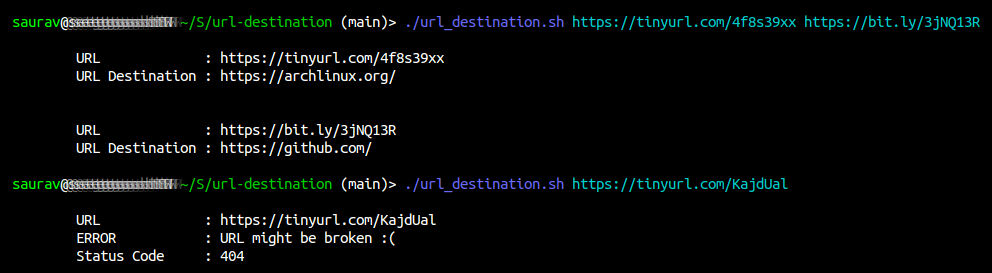

# URL Destination

## Installation And Usage

```bash
git clone https://github.com/saurzv/url-destination.git
cd url-destination

./url_destination.sh [URL(s)]
```

## Example

Here's one example


